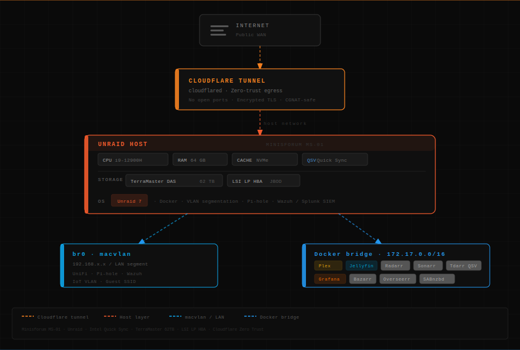
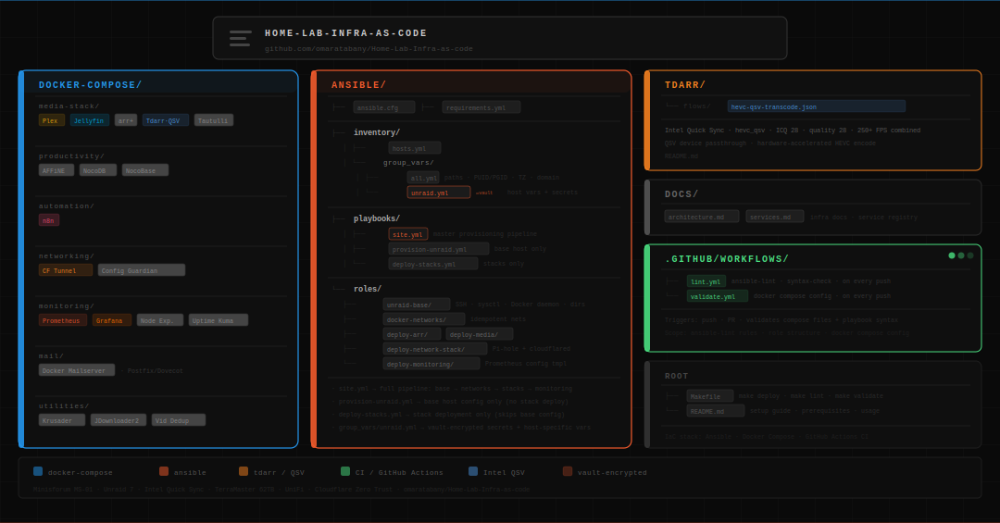

# Homelab Infrastructure as Code

Self-hosted media, productivity, automation, and networking stack running on **Unraid** (Minisforum MS-01 · i9-12900H · 64 GB RAM), managed via Docker Compose with full Ansible provisioning. Built to demonstrate real-world DevOps practices: multi-stack service orchestration, network segmentation, secret management, idempotent provisioning, and remote access via zero-trust tunneling.

---

## Architecture Overview

[]

---

## Repository Structure

[]

---

## Stacks

| Stack | Services | Network |
|---|---|---|
| [media-stack](docker-compose/media-stack/) | Plex, Jellyfin, Sonarr, Radarr, Bazarr, Prowlarr, SABnzbd, qBittorrent, Tdarr, Tautulli, Jellyseerr | `media_net`, `proxy_net` |
| [productivity](docker-compose/productivity/) | AFFiNE + Postgres + Redis, NocoDB, NocoBase | isolated bridge networks |
| [automation](docker-compose/automation/) | n8n | `bridge` |
| [networking](docker-compose/networking/) | Cloudflare Tunnel, Unraid Config Guardian | `proxy_net`, `dns_net` |
| [monitoring](docker-compose/monitoring/) | Prometheus, Grafana, Node Exporter, cAdvisor, Uptime Kuma | `monitoring_net`, `proxy_net` |
| [mail](docker-compose/mail/) | Docker Mailserver (Postfix/Dovecot/SpamAssassin/ClamAV) | `bridge` |
| [utilities](docker-compose/utilities/) | Krusader, JDownloader2, Video Duplicate Finder | `bridge` |

---

## Network Topology

| Network | Driver | Purpose |
|---|---|---|
| `proxy_net` | bridge | Cloudflare Tunnel to all exposed services |
| `media_net` | bridge | arr suite to media servers (Plex/Jellyfin) |
| `monitoring_net` | bridge | Prometheus scrape targets |
| `dns_net` | bridge | Pi-hole DNS resolution |
| `host` | host | Plex DLNA/GDM discovery |

All external networks are created once via `make networks` and shared across stacks. No service relies on the default Docker bridge.

---

## Ansible Provisioning Pipeline

The `ansible/` layer takes a bare Unraid host to a fully running state in a single command. It is designed to be run against the host before or alongside manual Docker Compose deploys, or as the sole deployment mechanism.

```
make deploy

  1. unraid-base        SSH hardening, sysctl tuning, Docker daemon config,
                        appdata directory scaffold, transcode scratch dir
  2. docker-networks    Create all external networks (idempotent)
  3. deploy-arr         Copy compose file, render .env from vault, pull, up,
                        wait for Radarr + Sonarr healthchecks
  4. deploy-media       Copy compose file, verify /dev/dri, pull, up,
                        wait for Jellyfin healthcheck
  5. deploy-network-stack  Copy compose file, check port 53, pull, up,
                        wait for Pi-hole DNS response
  6. deploy-monitoring  Template prometheus.yml with host vars, copy compose,
                        pull, up, wait for Grafana + Prometheus healthchecks
```

All roles are idempotent. Re-running `make deploy` only touches changed resources.

### Tag-driven selective runs

```bash
make provision                      # Base host config only
make deploy-stack TAGS=monitoring   # Monitoring stack only
make deploy-stack TAGS=arr,media    # Multiple stacks
make ansible-check                  # Dry run -- no changes applied
```

---

## Getting Started

### Prerequisites

- Unraid 7.x (or any Docker host with `docker compose` v2)
- Cloudflare account with a tunnel token
- Domain with Cloudflare DNS
- For Ansible: Python 3.10+, Ansible 2.15+, SSH key access to the Unraid host

### Compose-only deploy

```bash
git clone https://github.com/omaratabany/Home-Lab-Infra-as-code
cd Home-Lab-Infra-as-code

# Create external networks
make networks

# Configure environment for each stack
for stack in docker-compose/*/; do
  cp "$stack/.env.example" "$stack/.env"
done
# Edit each .env with your actual values

# Start a stack
make up STACK=media-stack

# Or start everything
make up-all
```

### Full Ansible deploy

```bash
# Install collections
make collections

# Configure inventory
cp ansible/inventory/hosts.yml.example ansible/inventory/hosts.yml
# Set ansible_host to your Unraid IP

# Encrypt secrets
ansible-vault encrypt_string 'your-value' --name 'cf_tunnel_token'
# Add vault output to ansible/inventory/group_vars/unraid.yml

# Dry run
make ansible-check

# Full provisioning + deploy
make deploy
```

---

## Secret Management

Secrets are never committed. Two mechanisms are used:

**Docker Compose**: Each stack has a `.env.example`. Copy to `.env` (gitignored) and populate. Files are `chmod 600` on the host.

**Ansible**: Secrets in `ansible/inventory/group_vars/unraid.yml` are encrypted with Ansible Vault using `!vault` inline blocks. The vault password file (`.vault_pass`) is gitignored. In CI, the vault password is passed via a GitHub Actions secret.

Generate a strong password:

```bash
openssl rand -base64 32
```

---

## Hardware Notes

| Component | Detail |
|---|---|
| Host | Minisforum MS-01, i9-12900H, 64 GB RAM |
| OS | Unraid 7 |
| Storage | TerraMaster DAS (~62 TB), NVMe for appdata and transcode cache |
| GPU | Intel UHD (Quick Sync) -- `hevc_qsv`, ICQ 28, `veryfast` |
| Networking | UniFi, full VLAN segmentation, CGNAT (DU Telecom) |
| Remote access | Cloudflare Tunnel (zero-trust, no open ports) + Tailscale fallback |
| Domain | "your-domain" via Cloudflare DNS |

---

## CI

| Workflow | Trigger | What it does |
|---|---|---|
| `validate.yml` | Push/PR to `docker-compose/**` | Stubs `.env` vars, runs `docker compose config --quiet` on all stacks |
| `lint.yml` | Push/PR to `ansible/**` | Runs `ansible-lint` and `--syntax-check` on all playbooks |

---

## Tdarr Flows

Custom transcode flows are documented in [`tdarr/`](tdarr/). The primary flow targets HEVC re-encode via Intel Quick Sync with ICQ 28 quality setting and `veryfast` preset, applied to all library content above a bitrate threshold.

---

## License

MIT
